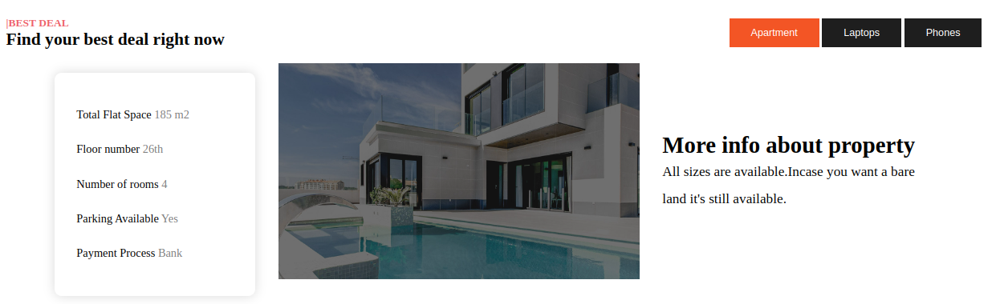

# swap__properties
___

## Project description ##
___

swap__properties that helps one to exchange their properties under high supervision
___[Title](../../html_css/medic_care_clinic/README.md)
## live link ##
To access the project live use this link

___
## Screenshots ##
___
This is a copy of the project

* html 
* css
## project setting installation##
1. Open the terminal and navigate the  code to where you want to store the project eg `cd Desktop`
2. To clone the github project paste this on the terminal `git clone https://github.com/Silasgloria254/medical_care.git`
3. Use cd medical-care to get into the project directory
4. Open the project with your favorite browers
___
## contact ##
if you would like to get more information,collaboration  and feedback use this address
**silag9202@gmail.com**
___
## license ##
MIT License

Copyright (c) [***2024***] [***sila***]

Permission is hereby granted, free of charge, to any person obtaining a copy
of this software and associated documentation files (the "Software"), to deal
in the Software without restriction, including without limitation the rights
to use, copy, modify, merge, publish, distribute, sublicense, and/or sell
copies of the Software, and to permit persons to whom the Software is
furnished to do so, subject to the following conditions:

The above copyright notice and this permission notice shall be included in all
copies or substantial portions of the Software.

THE SOFTWARE IS PROVIDED "AS IS", WITHOUT WARRANTY OF ANY KIND, EXPRESS OR
IMPLIED, INCLUDING BUT NOT LIMITED TO THE WARRANTIES OF MERCHANTABILITY,
FITNESS FOR A PARTICULAR PURPOSE AND NONINFRINGEMENT. IN NO EVENT SHALL THE
AUTHORS OR COPYRIGHT HOLDERS BE LIABLE FOR ANY CLAIM, DAMAGES OR OTHER
LIABILITY, WHETHER IN AN ACTION OF CONTRACT, TORT OR OTHERWISE, ARISING FROM,
OUT OF OR IN CONNECTION WITH THE SOFTWARE OR THE USE OR OTHER DEALINGS IN THE
SOFTWARE.